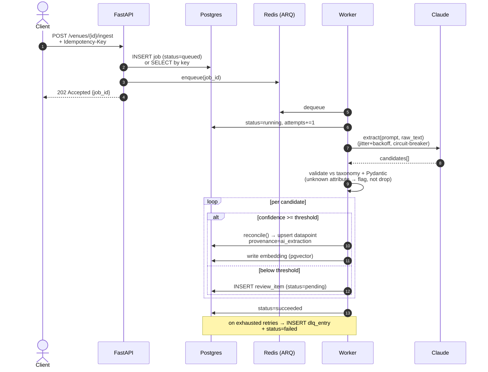
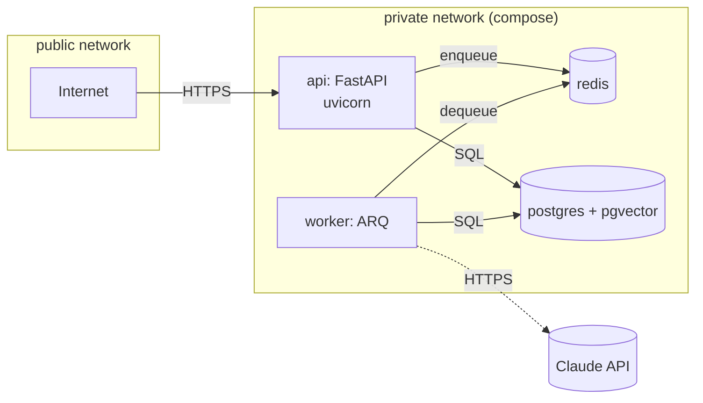

# AXIS — Architecture

> **Status:** authoritative — every component in this repo MUST trace back to a
> claim made here. If reality drifts from this document, this document is
> updated _before_ code lands. ADRs in `docs/adr/` record any deviation.

---

## 1. Mission

Accessibility data for physical venues lives as **unstructured prose** —
hotel descriptions, OTA copy, partner PDFs, tribal staff knowledge — written
for a non-disabled reader. Roughly 1.3 B people live with a disability;
their booking journey starts with *"can I actually use this place?"* and
typically ends with a phone call.

**AXIS is the structured-data and AI-extraction layer that turns that prose
into a typed, queryable accessibility taxonomy** — with provenance,
confidence, reconciliation, and semantic search. It is the engine that
powers a disability-aware booking search; it is **not** a booking product,
not a chatbot, not a CMS, not a review site.

The deliverable is an HTTP API a partner can integrate against. The promise
is: *"Send us your venue text. We return structured, verified, queryable
accessibility facts."*

---

## 2. Design Principles

These principles are load-bearing. Every PR is reviewed against them.

1. **LLM-where-fuzzy, deterministic-everywhere-rigid.**
   The Anthropic API is invoked at exactly **one** step of the ingestion
   pipeline (`extract`). IDs, idempotency, persistence, RBAC, reconciliation,
   search ranking, and pagination are classical code. The LLM never decides
   schema, identity, or authorization.

2. **Provenance is a first-class field, not a comment.**
   Every datapoint carries `provenance ∈ {human, partner_feed, ai_extraction}`
   and a `confidence ∈ [0, 1]`. Reconciliation is a documented precedence
   policy, not implicit "last write wins."

3. **Taxonomy is data, not enums.**
   Categories, attributes, and allowed value types live in versioned tables.
   Adding `hearing_loop_at_reception` is a migration + seed update, not a
   code deploy.

4. **Idempotent everything.**
   Every job carries an `idempotency_key`. Replaying a job MUST NOT
   double-write. Every external mutation is keyed; every internal upsert
   is conflict-aware.

5. **Nothing is lost.**
   Jobs that exhaust retries land in a `dlq_entry` row carrying the full
   original payload plus terminal error. Low-confidence AI candidates land
   in `review_item`. We surface failures; we don't swallow them.

6. **Strict at the edges, expressive in the core.**
   Pydantic v2 models guard the HTTP boundary. SQLAlchemy 2.0 typed mappers
   guard the database boundary. The domain layer between them is plain
   typed Python — `mypy --strict` clean, no `Any` without a justification
   comment.

7. **Observable by default.**
   Every request gets a correlation ID. Every ingestion gets an OTel trace
   spanning ingest → extract → reconcile → embed. Logs are structured JSON.
   `/metrics` is on by default.

8. **Versioned by contract.**
   API at `/api/v1`. Taxonomy carries a `version` column. Migrations are
   one-way; rollbacks are forward-only patches. No silent breaking changes.

---

## 3. Stack

Locked by [ADR-0001](docs/adr/0001-stack-selection.md). Substitutions require
a new ADR.

| Concern               | Choice                                         |
| --------------------- | ---------------------------------------------- |
| Language              | Python 3.12                                    |
| Web framework         | FastAPI                                        |
| ORM                   | SQLAlchemy 2.0 (async)                         |
| Migrations            | Alembic                                        |
| Edge validation       | Pydantic v2                                    |
| Database              | PostgreSQL 16 + pgvector                       |
| Keyword search        | Postgres FTS (tsvector)                        |
| Semantic search       | pgvector (HNSW)                                |
| Cache / broker        | Redis 7                                        |
| Background jobs       | ARQ (async-native)                             |
| LLM provider          | Anthropic Claude (via adapter interface)       |
| AuthN                 | OAuth2 password + JWT access / refresh rotation|
| AuthZ                 | RBAC scopes via FastAPI dependency             |
| Logging               | structlog (JSON)                               |
| Tracing               | OpenTelemetry → OTLP exporter                  |
| Metrics               | prometheus_client → `/metrics`                 |
| Rate limiting         | slowapi (Redis-backed)                         |
| Tests                 | pytest + pytest-asyncio + testcontainers + httpx |
| Lint / type           | ruff + mypy --strict                           |
| Container             | Docker + docker-compose                        |
| CI                    | GitHub Actions                                 |

Trust boundary: **only** the API container is internet-exposed. Worker,
Postgres, Redis are private network.

---

## 4. Domain Model

The schema is the product. Get it right.

### 4.1 ERD

```mermaid
erDiagram
    USER ||--o{ ROLE_ASSIGNMENT : "granted"
    ROLE ||--o{ ROLE_ASSIGNMENT : "to"
    ROLE ||--o{ ROLE_SCOPE       : "carries"
    SCOPE ||--o{ ROLE_SCOPE      : "in"
    USER ||--o{ REFRESH_TOKEN    : "owns"
    USER ||--o{ DATAPOINT        : "verifies"
    USER ||--o{ REVIEW_ITEM      : "resolves"

    TAXONOMY_VERSION  ||--o{ TAXONOMY_CATEGORY   : "scopes"
    TAXONOMY_CATEGORY ||--o{ TAXONOMY_ATTRIBUTE  : "groups"
    TAXONOMY_ATTRIBUTE ||--o{ ATTRIBUTE_ENUM_VALUE : "allows"

    VENUE                 ||--o{ DATAPOINT         : "has"
    VENUE                 ||--o{ INGESTION_JOB     : "ingested by"
    TAXONOMY_ATTRIBUTE    ||--o{ DATAPOINT         : "typed by"
    INGESTION_JOB         ||--o{ DATAPOINT         : "produced"
    INGESTION_JOB         ||--o{ REVIEW_ITEM       : "queued"
    INGESTION_JOB         ||--o| DLQ_ENTRY         : "failed into"
    DATAPOINT             ||--o| DATAPOINT         : "supersedes"

    USER {
      uuid   id PK
      citext email UK
      text   password_hash
      bool   is_active
      timestamptz created_at
    }
    ROLE {
      uuid id PK
      text name UK
    }
    SCOPE {
      text name PK
    }
    VENUE {
      uuid     id PK
      text     name
      text     venue_type
      text     country_code
      numeric  latitude
      numeric  longitude
      jsonb    source_metadata
      tsvector search_vector
      timestamptz created_at
    }
    TAXONOMY_VERSION {
      int    id PK
      text   semver UK
      timestamptz published_at
    }
    TAXONOMY_CATEGORY {
      text key PK "mobility|vision|hearing|cognitive|sensory"
      int  version FK
    }
    TAXONOMY_ATTRIBUTE {
      uuid id PK
      text key UK         "e.g. roll_in_shower"
      text category FK
      text value_type     "bool|numeric|enum"
      text unit           "nullable; e.g. cm"
      jsonb meta          "thresholds, descriptions"
    }
    DATAPOINT {
      uuid    id PK
      uuid    venue_id FK
      uuid    attribute_id FK
      jsonb   value         "typed by attribute.value_type"
      numeric confidence    "0..1, CHECK"
      text    provenance    "human|partner_feed|ai_extraction"
      uuid    verified_by FK "nullable"
      uuid    job_id FK     "nullable"
      uuid    supersedes_id FK "nullable, self-ref"
      vector  embedding     "pgvector(768)"
      timestamptz created_at
    }
    INGESTION_JOB {
      uuid    id PK
      uuid    venue_id FK
      text    idempotency_key UK
      text    status         "queued|running|succeeded|failed|dlq"
      jsonb   input
      jsonb   result
      int     attempts
      timestamptz created_at
      timestamptz finished_at
    }
    REVIEW_ITEM {
      uuid    id PK
      uuid    job_id FK
      uuid    venue_id FK
      uuid    attribute_id FK
      jsonb   candidate
      text    status         "pending|accepted|rejected|edited"
      uuid    resolved_by FK
      timestamptz resolved_at
    }
    DLQ_ENTRY {
      uuid    id PK
      uuid    job_id FK UK
      jsonb   payload
      text    terminal_error
      timestamptz created_at
    }
```

### 4.2 Invariants Enforced in the DB (not in app code)

- `datapoint.confidence` has `CHECK (confidence BETWEEN 0 AND 1)`.
- `datapoint.provenance` is a Postgres `ENUM` type; app code cannot assert an
  unknown provenance.
- `taxonomy_attribute.value_type` is an `ENUM`; the column `unit` is `NULL`
  unless `value_type = 'numeric'` (CHECK).
- `datapoint(venue_id, attribute_id, provenance)` carries a partial unique
  index `WHERE supersedes_id IS NULL` — at most one *live* fact per
  `(venue, attribute, provenance)`; older versions remain as the historical
  chain via `supersedes_id`.
- `venue.search_vector` is a generated column over `name || venue_type ||
  source_metadata->>'description'`, GIN-indexed.
- `datapoint.embedding` uses an HNSW index for cosine similarity.
- `ingestion_job.idempotency_key` is `UNIQUE`. Re-POSTing the same key
  returns the existing job ID (HTTP 200, not 201) — never enqueues twice.

### 4.3 Reconciliation Precedence

Conflicts between asserted facts are resolved by precedence, **not** by
recency:

```
human > partner_feed > ai_extraction
```

A lower-precedence write that contradicts a higher-precedence live fact does
**not** overwrite it. It is stored as a superseded datapoint (audit trail)
and emits a `reconciliation.conflict` log + metric. The conflict policy is
unit-tested as a single pure function `reconcile(existing, incoming) → Action`.

---

## 5. AI Ingestion Pipeline

Five stages, each idempotent, observable, and retryable.



### 5.1 Stages, in Words

1. **Ingest.** `POST /venues/{id}/ingest` accepts raw text + optional source
   URL + an `Idempotency-Key` header. The API never extracts inline; it
   only persists the job and enqueues. Returns `202` with `{job_id}`.

2. **Extract.** The worker calls `ExtractorProvider.extract(text)`. The
   contract returns `list[CandidateDatapoint]` — never raw model text. The
   Claude adapter is the *only* place that knows about prompts, models, or
   token budgets. The prompt instructs Claude to emit strict JSON matching
   a Pydantic-derived schema, including an `evidence_span` (start/end char
   offsets into the input) for every candidate.

3. **Score & route.** Candidates with `confidence ≥ τ_persist` (default 0.80)
   are reconciled and persisted as `ai_extraction`. Candidates with
   `τ_review ≤ confidence < τ_persist` (default 0.50–0.80) land in
   `review_item`. Below `τ_review` → dropped *with a metric*, never silently
   ignored.

4. **Reconcile.** The pure `reconcile()` function applies the precedence
   policy (§4.3). A demoted incoming fact is stored as a superseded
   datapoint, preserving audit history.

5. **Embed.** For every persisted datapoint, the worker produces an
   embedding (initial provider: Anthropic embeddings or sentence-transformers
   local — TBD in an ADR before Phase 6). The embedding is written to
   `datapoint.embedding` and indexed by pgvector HNSW.

### 5.2 Failure Semantics

- **Transient LLM error** (rate limit, 5xx, timeout): jittered exponential
  backoff, max 5 attempts, then DLQ.
- **Schema validation failure**: candidate dropped, structured log + metric,
  job continues. A whole-payload schema fail is a job fail.
- **Circuit breaker** on the provider: 5 consecutive failures within 60 s →
  open for 30 s; half-open one probe; closed on success. The breaker is
  process-local with a Redis-mirrored state for visibility.
- **DLQ**: terminal failures write a `dlq_entry` with the full input. There
  is a `GET /jobs/{id}` endpoint that returns DLQ context if relevant.

### 5.3 What the LLM is *not* allowed to do

- Invent attributes not in the taxonomy. Unknown attributes are flagged in
  `review_item.candidate.unknown_attribute = true`, never written to
  `datapoint`.
- Decide identity. The LLM never sees nor returns venue IDs.
- Decide confidence outside `[0, 1]`. Validated at the Pydantic boundary.
- Decide its own retries. The worker owns retry policy.

---

## 6. API Surface

Versioned at `/api/v1`. OpenAPI auto-rendered at `/docs`. Every list endpoint
takes a cursor (`?cursor=…&limit=…`) and returns `{items, next_cursor}`.

| Method | Path                              | Scope            | Purpose                                         |
| ------ | --------------------------------- | ---------------- | ----------------------------------------------- |
| POST   | `/auth/token`                     | —                | OAuth2 password → access + refresh              |
| POST   | `/auth/refresh`                   | —                | Rotate refresh, return new pair                 |
| POST   | `/auth/logout`                    | (any)            | Revoke refresh family                           |
| GET    | `/venues`                         | `venue:read`     | Filter + FTS + pagination                       |
| GET    | `/venues/{id}`                    | `venue:read`     | Full accessibility profile                      |
| POST   | `/venues`                         | `venue:write`    | Create venue (admin / partner)                  |
| POST   | `/venues/{id}/ingest`             | `ingest:run`     | Enqueue AI ingestion job                        |
| GET    | `/venues/search/semantic`         | `venue:read`     | pgvector similar-profile search                 |
| GET    | `/jobs/{id}`                      | `ingest:run`     | Job status, result, DLQ pointer                 |
| GET    | `/review-queue`                   | `review:resolve` | HITL queue listing                              |
| POST   | `/review-queue/{id}/resolve`      | `review:resolve` | Accept / reject / edit a candidate              |
| GET    | `/taxonomy`                       | (public-read)    | Controlled vocabulary, versioned                |
| POST   | `/taxonomy/versions`              | `taxonomy:admin` | Publish a new taxonomy version                  |
| GET    | `/healthz`                        | —                | Liveness (process up)                           |
| GET    | `/readyz`                         | —                | Readiness (DB + Redis reachable, migrations OK) |
| GET    | `/metrics`                        | —                | Prometheus exposition                           |

### 6.1 Filter Grammar on `/venues`

```
GET /api/v1/venues
  ?q=hotel%20central                   # FTS over search_vector
  &near=48.137,11.575&radius_km=5      # bounding-box, lat/lng for now
  &requires=roll_in_shower,step_free_entrance  # AND across attributes (bool=true)
  &country=DE
  &limit=50&cursor=<opaque>
```

`requires` is the load-bearing filter: it joins `datapoint` with
`taxonomy_attribute.key IN (…)` and requires every named attribute to have
a *live* datapoint with truthy value. The query is a single JOIN with
`HAVING COUNT(DISTINCT attribute) = N` — not N+1.

### 6.2 Partner API Keys

Partners receive a long-lived API key (hashed at rest, prefix-displayed) that
maps to the `partner:read` scope. Keys are first-class rows
(`api_key { id, hash, prefix, scopes, owner_id, revoked_at }`) so they can
be rotated and audited. JWT and API-key auth live behind a single
`AuthenticatedPrincipal` abstraction — endpoints never branch on which
credential was used, only on scope.

---

## 7. AuthN / AuthZ

### 7.1 Tokens

- **Access token**: JWT, 15 min, signed RS256 (key rotates monthly).
  Claims: `sub` (user id), `scopes` (list), `jti`, standard timestamps.
- **Refresh token**: opaque random, stored hashed in `refresh_token` table
  with `family_id`, `parent_id`, `revoked_at`. **Rotation on every use** with
  reuse detection — if a previously-rotated token is presented, the entire
  family is revoked (token-theft mitigation).

### 7.2 Scopes

The complete scope catalog:

```
venue:read       venue:write       ingest:run
review:resolve   taxonomy:admin    partner:read
```

Scopes are granted via roles (`role_scope` join table). Roles are granted to
users (`role_assignment`). The default seeded roles are:

| Role         | Scopes                                                                 |
| ------------ | ---------------------------------------------------------------------- |
| `admin`      | all                                                                    |
| `editor`     | `venue:read`, `venue:write`, `ingest:run`, `review:resolve`            |
| `reviewer`   | `venue:read`, `review:resolve`                                         |
| `reader`     | `venue:read`                                                           |
| `partner`    | `partner:read` (mapped via API key, not JWT)                           |

### 7.3 Enforcement

Authorization is enforced by a single FastAPI dependency:

```python
@router.get("/venues", dependencies=[Depends(require_scope("venue:read"))])
```

There are zero scattered `if user.is_admin` checks. The dependency reads
scopes off the validated principal and `403`s on missing scope. The
dependency factory is the only allowed enforcement point — verified by a
ruff custom rule + test that greps for forbidden patterns.

---

## 8. Observability

| Pillar  | Mechanism                                                          |
| ------- | ------------------------------------------------------------------ |
| Logs    | `structlog` JSON, request_id + trace_id in every record           |
| Traces  | OpenTelemetry, OTLP exporter; spans on every API route + every ingestion stage |
| Metrics | `prometheus_client` → `/metrics`; histograms per route, counters per ingestion outcome, breaker state gauge |
| Health  | `/healthz` = process up; `/readyz` = DB + Redis + migration head check |

Ingestion span tree (target shape):

```
ingest.job (job_id)
├── ingest.extract (provider, model, tokens_in/out)
├── ingest.validate (candidates_total / dropped / unknown)
├── ingest.reconcile (conflicts)
├── ingest.persist (datapoints_written, reviews_queued)
└── ingest.embed (count)
```

---

## 9. Deployment Topology



- Only `api` is internet-exposed (port 8000 in compose, fronted by Caddy in
  prod).
- Worker, Redis, Postgres are private.
- `Claude API` is the only outbound dependency from the worker; in tests it
  is replaced by a `FakeExtractor` via the `ExtractorProvider` interface.

---

## 10. Repository Layout (target — Phase 0 lays this down)

```
axis-accessibility-api/
├── ARCHITECTURE.md                 # this file
├── README.md
├── pyproject.toml                  # ruff, mypy, pytest, hatch
├── .pre-commit-config.yaml
├── .env.example
├── docker-compose.yml              # api, worker, postgres, redis
├── Dockerfile
├── alembic.ini
├── docs/
│   ├── adr/                        # MADR records, NNNN-title.md
│   └── diagrams/
├── src/axis/
│   ├── __init__.py
│   ├── main.py                     # FastAPI app factory
│   ├── config.py                   # pydantic-settings
│   ├── api/v1/
│   │   ├── deps.py                 # require_scope, get_principal
│   │   ├── auth.py
│   │   ├── venues.py
│   │   ├── jobs.py
│   │   ├── review.py
│   │   ├── taxonomy.py
│   │   └── health.py
│   ├── domain/                     # plain typed Python; no FastAPI, no SA
│   │   ├── models.py
│   │   ├── reconciliation.py
│   │   └── taxonomy.py
│   ├── db/                         # SA mappers + session
│   │   ├── base.py
│   │   ├── models/
│   │   └── migrations/             # Alembic env + versions
│   ├── extraction/
│   │   ├── provider.py             # ExtractorProvider Protocol
│   │   ├── anthropic_provider.py
│   │   ├── prompts.py
│   │   └── fake.py                 # deterministic test provider
│   ├── ingestion/
│   │   ├── pipeline.py             # the 5-stage orchestrator
│   │   ├── tasks.py                # ARQ task entrypoints
│   │   ├── idempotency.py
│   │   ├── circuit.py
│   │   └── retry.py
│   ├── auth/
│   │   ├── jwt.py
│   │   ├── refresh.py
│   │   └── rbac.py
│   ├── search/
│   │   ├── fts.py
│   │   └── semantic.py
│   ├── observability/
│   │   ├── logging.py
│   │   ├── tracing.py
│   │   └── metrics.py
│   └── seed/
│       └── taxonomy_v1.json        # seeded vocabulary
└── tests/
    ├── unit/
    ├── integration/                # testcontainers Postgres
    └── conftest.py
```

A few rules baked into the layout:

- `domain/` is framework-free. It does not import FastAPI or SQLAlchemy.
- `extraction/` is the *only* directory allowed to import the Anthropic SDK.
  Enforced by a unit test that greps imports.
- Alembic lives inside `src/axis/db/migrations` so it ships in the wheel.

---

## 11. Non-Goals

- **Not a booking engine.** AXIS exposes accessibility facts; downstream
  products book.
- **Not a venue review / star-rating product.** Confidence is a
  data-quality signal, not a review score.
- **Not a self-service chatbot.** No `/chat` endpoint. The LLM is internal.
- **Not a CMS.** Venues are created via API by partners or admins, not
  authored in a UI.
- **Not multi-tenant in v1.** Partner isolation is by scope + ownership
  checks, not by row-level separation. Documented as a deferred tradeoff
  (will become an ADR if v2 demands it).
- **Not internationalized in v1.** Taxonomy keys are English. Display
  translations are deferred.

---

## 12. Deferred Decisions (will become ADRs as Phases reach them)

| # | Decision                                                              | When               |
|---| --------------------------------------------------------------------- | ------------------ |
| 1 | Embedding provider (Anthropic embed vs local sentence-transformers)   | Phase 6            |
| 2 | Spatial: stay on lat/lng+haversine vs adopt PostGIS                   | Phase 6+ if needed |
| 3 | DLQ replay workflow (manual UI vs CLI)                                | Phase 5            |
| 4 | Partner key rotation cadence and revocation UX                        | Phase 2 / post     |
| 5 | OTel collector target (self-hosted Tempo vs vendor)                   | Phase 7            |

---

## 13. Engineering Standards

I won't merge a change I can't defend. It has to do what this document
claims, stay `mypy --strict` clean with every `Any` justified inline, and
ship with tests that assert real behavior rather than just that a call
returned. I don't merge auth bypasses, injection holes, leaked secrets, or
RBAC gaps, and I try not to leave code a teammate would need a tour to
read. Anything that falls short is fixed before it lands.

---

## 14. Glossary

- **Datapoint** — a single structured accessibility fact about a venue.
- **Attribute** — a member of the taxonomy (e.g. `roll_in_shower`).
- **Provenance** — who/what asserted a datapoint.
- **Idempotency key** — opaque client-supplied string ensuring at-most-once
  job creation.
- **DLQ** — dead-letter queue; terminal failures with full payload preserved.
- **HITL** — human-in-the-loop; low-confidence AI candidates resolved by a
  reviewer.

---

*This document is updated before code that contradicts it lands. If you
find a divergence, treat the document as authoritative and open an ADR or
a PR that updates it.*
