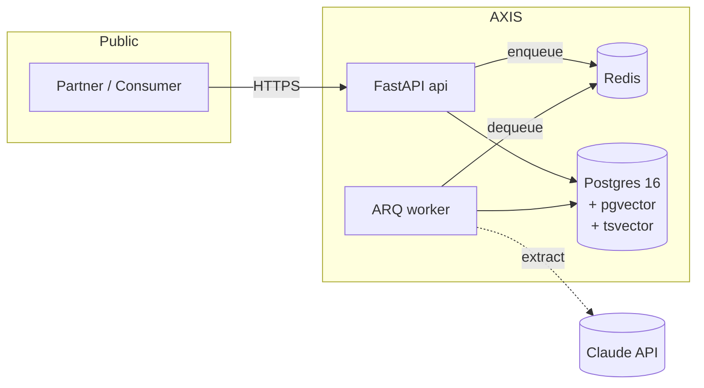

# AXIS — Accessibility Intelligence API

> **The structured-data and AI-extraction layer behind disability-aware search.**
> Turn unstructured venue prose into a typed, queryable accessibility taxonomy —
> with provenance, confidence, reconciliation, and semantic search.

[](https://github.com/EdgeF-4/axis-accessibility-api/actions/workflows/ci.yml)
[](#)
[](http://mypy-lang.org/)
[](https://github.com/astral-sh/ruff)
[](https://www.python.org/downloads/)
[](https://fastapi.tiangolo.com/)
[](https://www.postgresql.org/)
[](LICENSE)

---

## The problem

≈ 1.3 billion people live with a disability. The accessibility data they need
to make a booking decision — *step-free entrance, roll-in shower, hearing
loop, braille signage, door width in cm* — lives almost exclusively in
**unstructured prose** written for a non-disabled reader. A wheelchair user
trying to find a hotel filters by star rating and breakfast included; they
cannot filter by "step-free entrance" because there is no field to filter on.

## What AXIS does

AXIS is the API that fixes the data layer.

1. **Ingest** unstructured venue text via partner integration or upload.
2. **Extract** structured candidate datapoints with Claude under a strict
   JSON contract validated against a versioned taxonomy.
3. **Score & route** — high-confidence facts persisted with full provenance;
   low-confidence facts land in a human-review queue.
4. **Reconcile** conflicting sources by a documented precedence policy
   (`human > partner_feed > ai_extraction`).
5. **Serve** the result through a versioned REST API with full-text,
   attribute, and semantic similarity search.

It is **not** a booking engine, a review product, or a chatbot. It is the
data + intelligence layer behind any product that needs to make physical-
world accessibility searchable.

## Architecture



Full design — domain model, ERD, ingestion pipeline sequence, RBAC model,
observability strategy — lives in **[ARCHITECTURE.md](./ARCHITECTURE.md)**.
Per-decision rationale lives under **[docs/adr/](./docs/adr/)**.

## Design principles

These are load-bearing. Every PR is held against them.

1. **LLM only where input is fuzzy.** Identity, persistence, RBAC,
   reconciliation, and pagination are deterministic code. The Anthropic SDK
   is allowed only under `axis.extraction.*` — enforced by a build-failing
   import-discipline test. See [ADR-0003](docs/adr/0003-llm-scope.md).
2. **Provenance is first-class.** Every datapoint carries `(source,
   confidence, evidence)`. Conflicts are surfaced, not overwritten.
3. **Taxonomy as data.** Categories, attributes, units, and value types are
   tables — versioned, queryable, the validation contract for ingestion.
4. **Idempotent ingestion or it didn't happen.** Every job carries an
   `Idempotency-Key`. Re-runs never double-write.
5. **Lose nothing.** Terminal failures land in a DLQ with full payload.
   Low-confidence candidates land in a human-review queue.
6. **Boring storage, sharp queries.** One database — Postgres — for
   relational, full-text (tsvector), and semantic search (pgvector HNSW).
7. **One enforcement point for authorization.** `require_scope` is the
   only allowed gate. Inline `if user.is_admin` / `if scope in …` checks
   fail the build.

## 60-second walkthrough

```bash
# 1. Configure
cp .env.example .env
# (set ANTHROPIC_API_KEY and AXIS_JWT_SECRET to real values)

# 2. Bring up the stack
docker compose up -d
# api, worker, postgres + pgvector, redis — all healthy

# 3. OpenAPI lives at:
open http://localhost:8000/docs
```

Once it's up, a complete partner integration looks like this:

```bash
# Mint an editor user (one-time, via the seeded role catalogue):
TOKEN=$(curl -s -X POST http://localhost:8000/api/v1/auth/token \
  -d "username=alice@example.com&password=secret" | jq -r .access_token)

# Create a venue:
VENUE=$(curl -s -X POST http://localhost:8000/api/v1/venues \
  -H "Authorization: Bearer $TOKEN" -H "Content-Type: application/json" \
  -d '{"name":"Hotel Central","venue_type":"hotel","country_code":"DE",
       "description":"Step-free entrance and roll-in shower."}' | jq -r .id)

# Enqueue an AI ingestion job (note the Idempotency-Key — required):
curl -s -X POST "http://localhost:8000/api/v1/venues/$VENUE/ingest" \
  -H "Authorization: Bearer $TOKEN" -H "Content-Type: application/json" \
  -H "Idempotency-Key: import-2026-05-28-001" \
  -d '{"text":"Step-free entrance from the street; bathroom has a roll-in shower with a fold-down seat."}'

# After the worker drains:
curl -s "http://localhost:8000/api/v1/venues/$VENUE" \
  -H "Authorization: Bearer $TOKEN" | jq '.datapoints'
# -> [
#      {"attribute_key":"step_free_entrance","value":true, "provenance":"ai_extraction", ...},
#      {"attribute_key":"roll_in_shower",   "value":true, "provenance":"ai_extraction", ...}
#    ]

# Find venues with a similar accessibility profile:
curl -s "http://localhost:8000/api/v1/venues/search/semantic?q=roll-in%20shower%20step-free" \
  -H "Authorization: Bearer $TOKEN" | jq '.items[0:3]'
```

## Build phases

| Phase | Scope                                                                  | Status |
| ----- | ---------------------------------------------------------------------- | ------ |
| 0     | Repo scaffold, ARCHITECTURE.md, ADR-0001                               | ✅      |
| 1     | Domain model + Alembic migrations + taxonomy seed (UUID v7, ADR-0002)  | ✅      |
| 2     | Auth (JWT + refresh rotation) + RBAC scopes                            | ✅      |
| 3     | Read API: venues CRUD + FTS + cursor pagination + OpenAPI              | ✅      |
| 4     | AI ingestion pipeline (extract + idempotency + DLQ + circuit breaker)  | ✅      |
| 5     | Human-in-the-loop review queue + DLQ replay                            | ✅      |
| 6     | pgvector embeddings + semantic search (ADR-0004)                       | ✅      |
| 7     | Observability — structlog + OTel + Prometheus                          | ✅      |
| 8     | GitHub Actions CI, coverage gate ≥85%, README polish                   | ✅      |
| 9     | Profile presentation (pinned flagship)                                 | next   |

## Stack

| Layer              | Choice                                                       |
| ------------------ | ------------------------------------------------------------ |
| Language           | Python 3.12                                                  |
| Web                | FastAPI                                                      |
| ORM                | SQLAlchemy 2.0 (async)                                       |
| Migrations         | Alembic                                                      |
| Validation         | Pydantic v2                                                  |
| Database           | PostgreSQL 16 + pgvector                                     |
| Search             | Postgres FTS (tsvector) + pgvector HNSW                      |
| Cache / broker     | Redis 7                                                      |
| Jobs               | ARQ (async-native)                                           |
| LLM                | Anthropic Claude (behind `ExtractorProvider` adapter)        |
| Embeddings         | sentence-transformers `all-MiniLM-L6-v2` (ADR-0004)          |
| Auth               | OAuth2 password + JWT + refresh rotation                     |
| Observability      | structlog (JSON) + OpenTelemetry + Prometheus `/metrics`     |
| Tests              | pytest + pytest-asyncio + testcontainers + httpx             |
| Lint / type        | ruff + mypy --strict                                         |

Stack rationale: [ADR-0001](docs/adr/0001-stack-selection.md).

## Repository layout

```
axis-accessibility-api/
├── ARCHITECTURE.md            # source of truth for design
├── docs/
│   └── adr/                   # MADR records, per-decision
├── src/axis/
│   ├── api/v1/                # HTTP surface (FastAPI routers)
│   ├── auth/                  # JWT, refresh, principal, RBAC
│   ├── db/                    # SA mappers, migrations, queries, seed
│   ├── domain/                # framework-free types + reconcile rule
│   ├── extraction/            # ExtractorProvider — only path to Anthropic
│   ├── embeddings/            # EmbeddingProvider — Fake + Local
│   ├── ingestion/             # 6-stage pipeline orchestrator
│   ├── observability/         # structlog, tracing, metrics, middleware
│   └── seed/                  # v1 controlled vocabulary
└── tests/                     # unit + integration (testcontainers)
```

A few rules baked into the layout:

- `axis.domain` is framework-free — no FastAPI, no SQLAlchemy.
- `axis.extraction` is the **only** package allowed to import `anthropic`.
- Alembic migrations ship inside the wheel under `src/axis/db/migrations/`.
- `tests/test_import_discipline.py` fails the build on any drift.

## License

MIT — see [LICENSE](./LICENSE).
