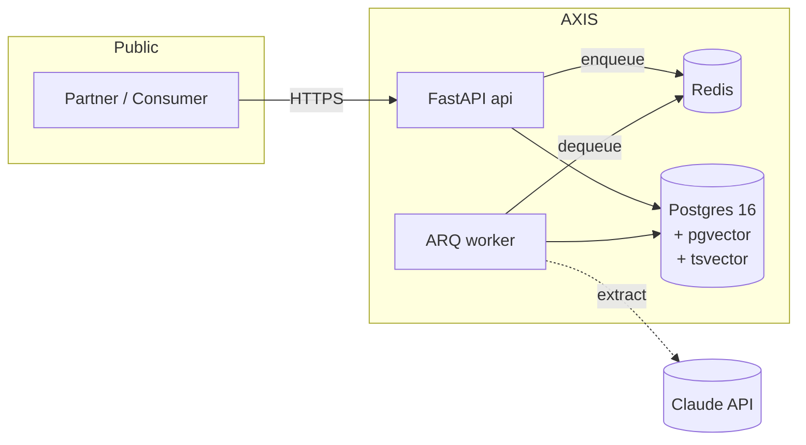

# AXIS — Accessibility Intelligence API

> **The structured-data and AI-extraction layer behind disability-aware search.**
> Turn unstructured venue prose into a typed, queryable accessibility taxonomy —
> with provenance, confidence, reconciliation, and semantic search.

[](https://www.python.org/downloads/)
[](https://fastapi.tiangolo.com/)
[](https://www.postgresql.org/)
[](http://mypy-lang.org/)
[](https://github.com/astral-sh/ruff)
[](LICENSE)

> 🛠 **Status:** Phase 0 of 9 — scaffolding complete. API endpoints come online
> in Phase 3 (read API) and Phase 4 (AI ingestion pipeline). See
> [ARCHITECTURE.md](./ARCHITECTURE.md) for the full plan.

---

## The problem

≈ 1.3 billion people live with a disability. The accessibility data they need
to make a booking decision — *step-free entrance, roll-in shower, hearing
loop, braille signage, door width in cm* — lives almost exclusively in
**unstructured prose** written for a non-disabled reader. A wheelchair user
trying to find a hotel filters by star rating and breakfast included; they
cannot filter by "step-free entrance" because there is no field to filter on.

## What AXIS does

AXIS is the API that fixes the data layer.

1. **Ingest** unstructured venue text via a partner integration or upload.
2. **Extract** structured candidate datapoints using Claude, with strict JSON
   output validated against a versioned taxonomy.
3. **Score & route** — high-confidence facts are persisted with full
   provenance; low-confidence facts land in a human-review queue.
4. **Reconcile** conflicting sources by a documented precedence policy
   (`human > partner_feed > ai_extraction`).
5. **Serve** the result through a versioned REST API with full-text filter,
   attribute filter, and semantic similarity search.

It is **not** a booking engine, a review product, or a chatbot. It is the
data + intelligence layer that sits behind any product that needs to make
physical-world accessibility searchable.

## Architecture at a glance



Full design — domain model, ERD, ingestion pipeline sequence, RBAC model,
observability strategy, deferred decisions — lives in
**[ARCHITECTURE.md](./ARCHITECTURE.md)**.
Per-decision rationale lives under **[docs/adr/](./docs/adr/)**.

## Design principles (load-bearing)

1. **LLM only where input is fuzzy.** Identity, persistence, RBAC,
   reconciliation, and pagination are deterministic code. The model is
   confined to the `extract` stage.
2. **Provenance is first-class.** Every datapoint carries `(source,
   confidence, evidence)`. Conflicts are surfaced, not overwritten.
3. **Taxonomy as data.** Categories, attributes, units, and value types are
   tables — versioned, queryable, the validation contract for ingestion.
4. **Idempotent ingestion or it didn't happen.** Every job carries an
   `idempotency_key`. Re-runs never double-write.
5. **Lose nothing.** Terminal failures land in a DLQ with full payload.
   Low-confidence candidates land in a human-review queue.
6. **Boring storage, sharp queries.** One database — Postgres — for
   relational, full-text, and semantic search.

## Quick start (Phase 0)

```bash
# Clone
git clone git@github.com:EdgeF-4/axis-accessibility-api.git
cd axis-accessibility-api

# Configure
cp .env.example .env
# (edit .env: at minimum set ANTHROPIC_API_KEY and AXIS_JWT_SECRET)

# Bring up the data plane
docker compose up -d db redis
docker compose ps           # both healthy
```

The API and worker containers ship in Phase 3+ once there is application
code to run. See [ARCHITECTURE.md §10](./ARCHITECTURE.md) for the planned
service topology.

## Stack

| Layer            | Choice                                                     |
| ---------------- | ---------------------------------------------------------- |
| Language         | Python 3.12                                                |
| Web              | FastAPI                                                    |
| ORM              | SQLAlchemy 2.0 (async)                                     |
| Migrations       | Alembic                                                    |
| Validation       | Pydantic v2                                                |
| Database         | PostgreSQL 16 + pgvector                                   |
| Search           | Postgres FTS (tsvector) + pgvector HNSW                    |
| Cache / broker   | Redis 7                                                    |
| Jobs             | ARQ (async-native)                                         |
| LLM              | Anthropic Claude (behind `ExtractorProvider` adapter)      |
| Auth             | OAuth2 password + JWT (RS256) + refresh rotation           |
| Observability    | structlog (JSON) + OpenTelemetry + Prometheus `/metrics`   |
| Tests            | pytest + pytest-asyncio + testcontainers + httpx           |
| Lint / type      | ruff + mypy --strict                                       |

Stack rationale: [docs/adr/0001-stack-selection.md](docs/adr/0001-stack-selection.md).

## Build phases

| Phase | Scope                                                                  |
| ----- | ---------------------------------------------------------------------- |
| 0     | Repo scaffold, ARCHITECTURE.md, ADR-0001 _(this is now)_               |
| 1     | Domain model + Alembic migrations + taxonomy seed                      |
| 2     | Auth (JWT + refresh rotation) + RBAC scopes                            |
| 3     | Read API: venues CRUD + FTS + cursor pagination + OpenAPI              |
| 4     | AI ingestion pipeline (extract + idempotency + DLQ + circuit breaker)  |
| 5     | Human-in-the-loop review queue + reconciliation policy                 |
| 6     | pgvector embeddings + semantic search endpoint                         |
| 7     | Observability — structlog + OTel + Prometheus + rate limiting          |
| 8     | GitHub Actions CI, coverage gate ≥85%, README polish                   |
| 9     | Profile presentation (pinned flagship, AXIS topics + description)      |

## Repository layout

See [ARCHITECTURE.md §10](./ARCHITECTURE.md) for the target tree. Highlights:

- `src/axis/domain/` — framework-free Pydantic + plain Python; no FastAPI, no SA.
- `src/axis/extraction/` — the **only** module allowed to import the
  Anthropic SDK (enforced by an import-discipline test).
- `src/axis/db/migrations/` — Alembic versions ship inside the wheel.
- `docs/adr/` — every load-bearing decision recorded in MADR format.

## License

MIT — see [LICENSE](./LICENSE).
